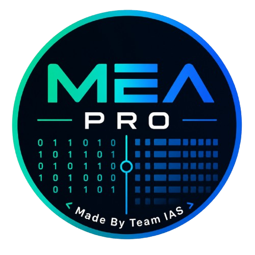
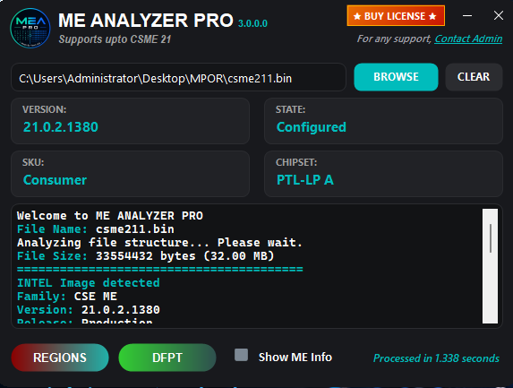
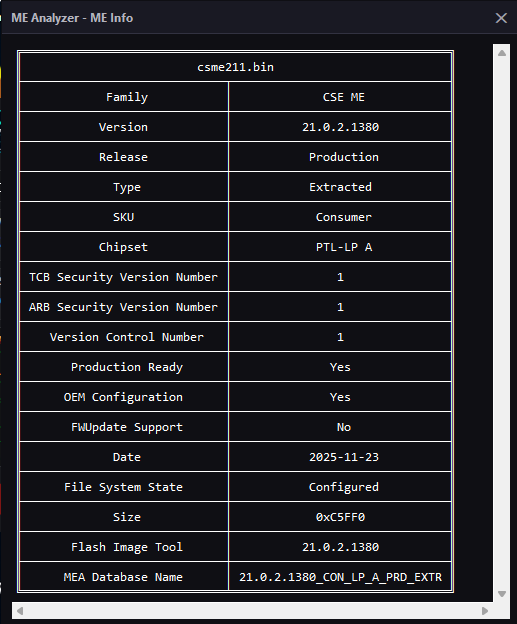
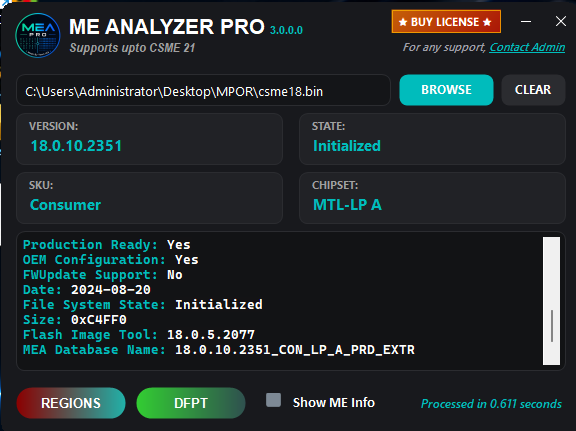
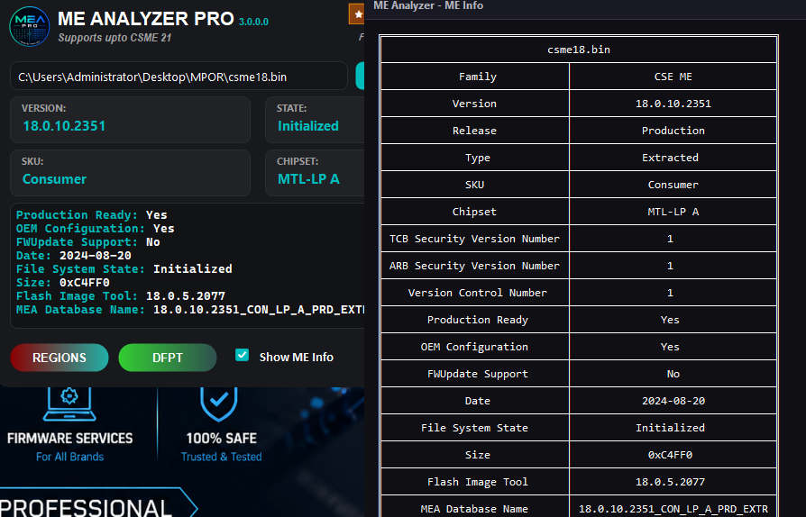
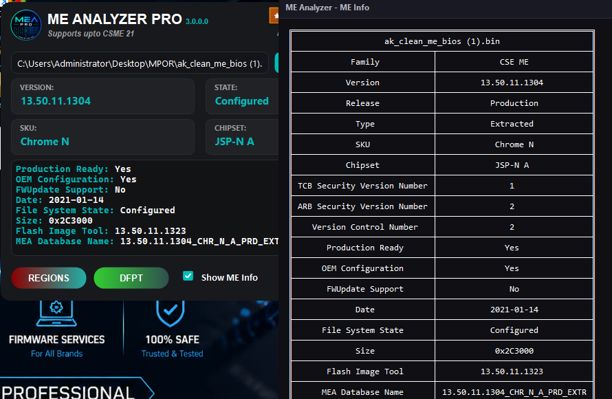

# 💎 ME ANALYZER PRO v3.0

<div align="center">
  
  <br>
  <h3>🚀 The Ultimate Firmware Analysis Tool</h3>
  <p><b>Developed By Team IAS</b></p>
  <p><i>Standalone | Premium UI | High-Performance Engine</i></p>
</div>

---

## 🛡️ CSME Support
**Supports up to Intel CSME 21**
Comprehensive analysis for the latest Intel Management Engine firmware.

---

## 📋 Description
**ME ANALYZER PRO v3.0** is a standalone, state-of-the-art analysis suite designed for Intel Management Engine (ME) firmware. Reimagined with a **Premium UI**, this version brings an advanced and highly interactive experience to firmware research.

### ✨ Key Features
- ⚡ **High Performance**: Optimized parallel asynchronous processing.
- 🔍 **Deep Analysis**: Supports Intel CSME versions up to **CSME 21**.
- 🛠️ **Robust Tooling**: Includes CLI and GUI versions for flexible workflows.
- 📦 **Standalone**: No additional dependencies or initialization scripts required.

---

## 🖼️ Features Showcase

<div align="center">

### ⚡ CSME 21 Firmware Analysis

<br>
<i>Analyze the latest Intel CSME 21 firmware — version, state, SKU, and chipset detected instantly.</i>
<br><br>

### 📊 Detailed ME Info Report

<br>
<i>Comprehensive firmware metadata — security versions, OEM config, production status, and MEA database matching.</i>
<br><br>

### 🔍 CSME 18 Quick Scan

<br>
<i>Blazing-fast analysis with results in under 1 second — supports CSME 18 through CSME 21.</i>
<br><br>

### 🖥️ Full Suite Overview

<br>
<i>Complete analysis workflow — main GUI + ME Info panel running side by side for maximum productivity.</i><br><br>

### 🖥️ CSME 13 Quick Scan

<br>
<i>Complete analysis workflow for Older CSME— main GUI + ME Info panel running side by side for maximum productivity.</i>

</div>

---

## 🎁 Free Trial & Pricing

<div align="center">

### 🆓 Try MEA PRO Free for 15 Days!

Experience the full power of ME Analyzer PRO — **no credit card required**.

Your trial is tied to a **single PC** so you can evaluate every feature with confidence.

</div>

| | **Trial** | **Licensed** |
|---|---|---|
| ⏳ Duration | **15 Days** | **Unlimited** |
| 🖥️ Activation | Single PC | Per License |
| 🔓 Features | Full Access | Full Access |
| 🛡️ Updates | ✅ Included | ✅ Included |

<div align="center">

**After your trial ends, purchase a license to continue using MEA PRO.**

<br>

<a href="https://iasviptools.com/mea-pro#pricing">
  
</a>

<br><br>

🔗 **[iasviptools.com/mea-pro#pricing](https://iasviptools.com/mea-pro#pricing)**

</div>


## 🚀 Quick Start

### 📋 Prerequisites
*   **OS**: Windows 10/11 (x64)

### 🛠️ Installation

1.  **Install the Suite**
    Execute `ME ANALYZER PRO.msi` to install the application.

2.  **Launch**
    Open **ME ANALYZER PRO** from your desktop and experience the future of firmware analysis!

---

## 📁 Project Structure

```text
MEA-Pro/
├── ME ANALYZER PRO.msi           # Standalone Suite Installer
├── MEA PRO.zip                   # Portable Archive
├── MeaPro30.png                  # Logo
└── README.md                     # Documentation
```

---

## 👨‍💻 Meet Our Developers

<table>
  <tr>
    <td align="center" width="50%">
      <br>
      
      <h3>🔧 SKB</h3>
      <b>BIOS MAGICIAN</b>
      <br><br>
      Passionate about BIOS development and system optimization. Leading our technical innovations and development team.
      <br><br>
      <a href="https://t.me/skbasirsona"></a>
      <a href="https://skbworld.co"></a>
    </td>
    <td align="center" width="50%">
      <br>
      
      <h3>⚡ Arshad Jackie</h3>
      <b>BIOS KING</b>
      <br><br>
      Expert in system architecture and BIOS modification. Dedicated to creating robust and efficient solutions.
      <br><br>
      <a href="https://t.me/arshadjackie"></a>
      <a href="https://refixguru.com"></a>
    </td>
  </tr>
</table>

---

## 🎯 Our Mission

> At **IAS VIP TOOLS**, we're dedicated to providing cutting-edge BIOS modification tools that empower IT professionals and system administrators to optimize their systems with **confidence and precision**. Our mission is to make advanced BIOS management accessible, secure, and efficient for everyone.

---

## 💡 Why Choose IAS VIP TOOLS?

| | Feature | Description |
|---|---|---|
| 🛡️ | **Professional Tools** | Industry-leading BIOS modification tools designed for professionals, with advanced features and robust security measures. |
| ⚡ | **Fast & Efficient** | Optimized performance and streamlined workflows to help you accomplish BIOS modifications quickly and efficiently. |
| 🎧 | **Expert Support** | Dedicated technical support team ready to assist you with any questions or challenges you may encounter. |

---

## 🌟 Our Values

<table>
  <tr>
    <td align="center" width="25%">
      <h3>🔒</h3>
      <b>Security First</b>
      <br>
      We prioritize the security and integrity of your systems in every tool we develop.
    </td>
    <td align="center" width="25%">
      <h3>🚀</h3>
      <b>Innovation</b>
      <br>
      Constantly evolving and improving our tools to meet the changing needs of our users.
    </td>
    <td align="center" width="25%">
      <h3>👥</h3>
      <b>User-Centric</b>
      <br>
      We build our tools with our users in mind, focusing on usability and practical solutions.
    </td>
    <td align="center" width="25%">
      <h3>✅</h3>
      <b>Reliability</b>
      <br>
      Committed to providing stable, reliable tools you can depend on for critical operations.
    </td>
  </tr>
</table>

---

<div align="center">
  <b>Ready to Get Started?</b>
  <br>
  Join thousands of professionals who trust <b>IAS VIP TOOLS</b> for their BIOS modification needs.
  <br><br>
  <a href="https://iasviptools.com"></a>
</div>


## 🤝 Support & Contact

For technical support, licensing, and inquiries — reach out to our admins on **Telegram**:

<div align="center">

<a href="https://t.me/arshadjackie"></a>

<a href="https://t.me/skbasirsona"></a>

</div>

---
<div align="center">
  <sub>Last updated: 2026-05-23 | © 2026 Team IAS</sub>
</div>
